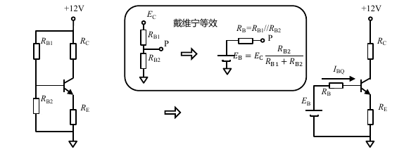

# 静态工作点的计算

依赖

* 简单放大电路&静态工作点
* 欧姆定律
* 基尔霍夫定律
* 戴维宁定理

默认条件下，为了取得最佳效果，静态工作点应该设置为三极管输出特性曲线的线性区域中心。这样可以确保在放大信号时，晶体管不会进入饱和或截止状态，从而减少失真。

也就是说，最佳静态工作点与输入信号无关。

那么，这个过程就变得很简单了。

### 大致步骤

首先，需要知道，$$U_{BEQ}=0.7V$$。

需要明确集电极电流$$I_C$$和输出电压$$U_{CE}$$，这两个参数决定了晶体管的工作状态。

主要步骤是：

1. 计算发射极电阻$$R_E$$（如果有）
2. 计算基极电阻$$R_B$$（可能是2个）
3. 计算集电极电阻$$R_C$$

<figure><figcaption>
两种阻容耦合放大电路
</figcaption></figure>

需要知道的是，就算基极只有一个电阻，而且发射极没有电阻（也就是说，和前面的「[简单放大电路](../jing-ti-guan/jian-dan-fang-da-dian-lu-jing-tai-gong-zuo-dian.md)」一样，只有2个电阻），电路也能够正常工作，只不过会不稳定。

> 为什么要并联一个电容？这个电容的作用是什么？

### 4电阻形

左边那个复杂的东西需要用到戴维宁等效

<figure><figcaption>
应用戴维宁等效
</figcaption></figure>

所以，在基极处，电压为

$$
E_B=\frac{R_{B2}}{R_{B1}+R_{B2}}E_C
$$

以及

$$
R_B=R_{B1}//R_{B2}=\frac{R_{B1}R_{B2}}{R_{B1}+R_{B2}}
$$

利用基尔霍夫电压定律，有

$$
E_B=I_{BQ}R_B+U_{BEQ}+(1+\beta)I_{BQ}R_E
$$

解得

$$
I_{BQ}=\frac{E_B-U_{BEQ}}{R_B+(1+\beta)R_E}
$$

根据欧姆定律，有

$$
U_{EQ}=I_{EQ}R_E
$$

$$
U_{CQ}=E_C-I_{CQ}R_C
$$

于是，就能得到

$$
U_{CEQ}=U_{CQ}-U_{EQ}=E_C-I_{CQ}R_C-I_{EQ}R_E
$$

其中

$$
I_{CQ}=\beta I_{BQ}
$$

$$
I_{EQ}=(1+\beta)I_{BQ}
$$

展开$$U_{CEQ}$$，则有

$$
U_{CEQ}=E_C-\beta\frac{E_B-U_{BEQ}}{R_B+(1+\beta)R_E}R_C-(1+\beta)\frac{E_B-U_{BEQ}}{R_B+(1+\beta)R_E}R_E
$$

整理，有

$$
\begin{align} U_{CEQ}&=E_C-\beta\frac{E_B-U_{BEQ}}{R_B+(1+\beta)R_E}R_C-(1+\beta)\frac{E_B-U_{BEQ}}{R_B+(1+\beta)R_E}R_E\\ &=E_C-\left[\beta R_c+(1+\beta)R_E \right]\frac{E_B-U_{BEQ}}{R_B+(1+\beta)R_E}\\ &=E_C-(E_B-U_{BEQ})\frac{\beta R_c+(1+\beta)R_E }{R_B+(1+\beta)R_E} \\ &=E_C-(E_B-U_{BEQ})\frac{\beta R_C-R_B+R_B+(1+\beta)R_E }{R_B+(1+\beta)R_E} \\ &=E_C-(E_B-U_{BEQ})\left(1+\frac{\beta R_C-R_B}{R_B+(1+\beta)R_E} \right) \end{align}
$$

当$$\beta$$比较大时，就有

$$
\lim_{\beta \rightarrow \infty}U_{CEQ}=E_C-(E_B-U_{BEQ})\left(1+\frac{R_C}{R_E}\right)
$$

这样一来，静态工作点就不会因为三极管$$\beta$$参数变化而变化了。

三极管的$$\beta$$参数对温度是有些敏感的，这种电路就不会出现类似于冬天正常的静态工作点，夏天漂移了这种神奇情况。

而且，三极管的$$\beta$$参数是比较分散的，可能只有100，150，200的三极管，没有中间的三极管。分散的三极管参数可能使电阻很难配。

### 3电阻形

4电阻电路中，将$$R_{B2}$$开路，就形成了3电阻电路。它的静态工作点同样是稳定的

由基尔霍夫电压定律，有

$$
I_{BQ}=\frac{E_B-U_{BEQ}}{R_B+(1+\beta)R_E}
$$

开路时，可以视为$$R_{B2}=\infty$$，那么，原先的$$R_{B1}//R_{B2}$$就被换成了$$R_{B}$$，其他不变，包括

$$
\lim_{\beta \rightarrow \infty}U_{CEQ}=E_C-(E_B-U_{BEQ})\left(1+\frac{R_C}{R_E}\right)
$$

但此时，由于没有$$R_{B2}$$的分压，会使得发射极静态点位接近电源电压，三极管的工作区间变得很小。

### 静态和动态分离

某个电阻如果在静态电路中存在，那么它也一定会出现在动态电路中。这就导致了一个结果:静态和动态是互相影响的。有时候，我们需要将静态和动态实施分离，以达到更灵活的设计。特别是，使得放大电路的电压增益可以独立调节。

上面电路的电容器对交流电的阻抗很小，但对直流电来说是开路。于是，对于静态电路，电容好像不存在一样；而对于动态电路，电容短路了电阻。

### 单级放大电路的静态工作点选择

一般所述的静态工作点$$Q$$，是指输出伏安特性曲线中的位置，由$$I_{CQ}$$和$$U_{CEQ}$$两个量组成。选择其位置，对放大电路整体性能有重要影响。

对静态工作点的选择，没有一成不变的规则。考虑的因素不同，设计的侧重点不同，就会带来不同的选择依据。

对$$U_{CEQ}$$来说，，一般情况下应选择为动态负载线的中心位置，以保证其有尽量大的 失真电压裕度。当两级单管放大器通过直接耦合级联时，还需要考虑第一级的输出静态电位，能不能驱动后级输入回路。

对$$I_{CQ}$$来说，情况就比较复杂。对于低功耗设计，尽量让$$I_{CQ}$$小。但这样做，势必会使用较大的电阻，这会导致整个电路的噪声增大，也导致输入电阻增大。而没有低功耗要求情况下，稍大一些的静态电流，会给输入电流变化带来足够的空间，这有利于降低干扰信号对电路的影响。换句话说，低功耗和抗干扰是矛盾的，这取决于设计者更看重什么。
